# 🌲 Blackforest: Advanced C++ Red Team Implant

> **⚠️ DISCLAIMER**: For Educational Use and Authorized Red Teaming ONLY. The author assumes no liability for misuse.

## 1. Project Overview
**Blackforest** is a professional-grade Windows implant designed for stealth, persistence, and automated long-term operation. It features a custom **Polymorphic Engine**, **Indirect Syscall execution**, and a unified **Team Server** for multi-user command & control.

### Key Features
*   **🕷️ Stealth**: Uses **Indirect Syscalls** (Assembly) to bypass user-mode EDR hooks (`jmp rax`).
*   **🧬 Polymorphism**: Generates a unique stub and hash for every single build.
*   **🔌 Persistent Networking**: Uses a single RAII-managed TCP socket with self-healing reconnection logic (No "noisy" connection spam).
*   **♾️ Loop-Proof Auto-Update**: Polls for updates (Port 8000) and safely upgrades itself only when the binary changes.
*   **🚀 Passwordless Deployment**: Automated SSH key injection for one-click updates.

---

## 2. Architecture

```mermaid
graph TD
    User["👑 Operator"] -->|Term| C2["💻 Team Server (Python)"]
    C2 --"Shell (4445)"--> Agent["🕷️ Blackforest Agent"]
    C2 --"Data (4444)"--> Agent
    Agent --"HTTP Poll (8000)"--> Update["📦 Update Server"]
    
    subgraph Victim Machine
        Agent -->|Hook| Keyboard["⌨️ Keylogs"]
        Agent -->|API| Screen["🖥️ Screenshots"]
        Agent -->|CMD| Shell["🐚 System Shell"]
    end
```



### Data Exfiltration Pipeline

```mermaid
sequenceDiagram
    participant K as ⌨️ Keyboard
    participant H as 🪝 Hook (Agent)
    participant B as 📦 Buffer
    participant N as 🔌 TCP Client
    participant S as 💻 C2 Server

    K->>H: Press 'A'
    H->>B: Add "A"
    
    opt Buffer Full or Timeout
        B->>N: Flush Data
        N->>N: 🔒 Encrypt Packet
        N->>S: Send (Persistent Socket)
        S-->>N: ACK
    end
```


---

## 3. Installation & Deployment

### Step 1: Start the Team Server
The Team Server unifies Shell and Data listeners into one dashboard.
```bash
python3 c2/server.py
```
*   **Port 4445**: Interactive Shells.
*   **Port 4444**: Data Stream.
*   **Port 8000**: Update Distribution.

### Step 2: One-Time Setup (Passwordless SSH)
To deploy without typing passwords every time, run this **ONCE**:
```bash
scripts/setup_ssh.sh
```
*   This generates an SSH key (if missing).
*   Uploads it to the victim (`Avengers@192.168.0.6`).
*   Configures `authorized_keys` on Windows.

### Step 3: CI/CD Deployment
Once setup is done, you can build and deploy endlessly with **One Command**:
```bash
scripts/build.sh    # 1. Compiles new polymorphic binary
scripts/deploy.sh   # 2. auto-uploads & executes (No Password!)
```
*   The agent will also auto-update itself via HTTP if already running.

---

## 4. Operation Guide

Inside the `c2/server.py` dashboard:
*   `list`: Show active shell sessions.
*   `interact <ID>`: Enter a remote shell.
*   **Keylogs**: Appear automatically in your terminal log file.

### Operational Security (OPSEC)
1.  **Identity Isolation**: You typically cannot keylog `Admin` if you are running as `User`. Always check `whoami`.
2.  **Persistence**: The agent survives reboots via `HKCU\Software\Microsoft\Windows\CurrentVersion\Run`.
3.  **Process Hiding**: Runs as `DETACHED_PROCESS` (No Window). Closing your SSH terminal does **NOT** kill the agent.

---

## 5. Emergency: Remote Kill Switch
To immediately self-destruct all active agents:
1.  **Stop C2 Server**.
2.  Edit `update.txt` in your web root.
3.  Replace content with the **Kill Key**:
    ```text
    09827a801ea931cdacf6ee8828b3283add9e694764a8c0aea06f73b9eed66d22
    ```
4.  **Wait 60 seconds**.
5.  All agents will:
    *   Detect the Kill Key.
    *   **Melt**: Delete their own executable and Registry keys.
    *   Terminate.

---

*🌲 Navigate the forest. Remain unseen. 🌲*
